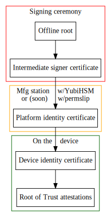

# Online Platform ID Certificate Signing

## Players

M: Manufacturing, played by Phil

N: Narrator, played by Alex

O: Operations, played by Ian

## Context

N: Before we ship a big board (Gimlet, Sidecar, or PSC), we assign it
a unique _platform identity_, which is represented by a signed X.509
certificate (see RFDs 273, 303). The private key used to sign those
certificates is quite sensitive: if someone were to steal it, they
could potentially mint fraudulent certificates for non-Oxide hardware.



N: Here's a rough diagram of the chain of signatures that goes into an
attestation from a Root of Trust on an Oxide device. At the top of the
diagram, in the red box, we have our offline root signing an intermediate
signing certificate. We call this a signing ceremony, and it's red to
indicate that this is an expensive operation: it takes a lot of people
many days to prepare and execute that one signature operation.

N: But once that's done, we can use that intermediate certificate to issue
platform identity certificates to the devices during manufacturing. That's
the orange box in the middle: it's not as expensive and sensitive as a
ceremony, but it's still sensitive. The key that's currently used to sign
those platform identity certificates lives on a YubiHSM, which is basically
a fancy, auditable, much more expensive YubiKey. To be sure it's not
misused, an Oxide employee has to physically carry that HSM to the
manufacturing station when we're ready to issue certs, unlock it with a
password, keep tabs on it at all times, and take it home and secure it when
they're done signing. This process worked well enough to issue certs for
our first few racks, but is inconvenient and risky. It's also basically
impossible to hand off to our manufacturing partner without introducing
even more inconvenience and risk.

N: Our solution, which we're going to demo today, is to use the Online
Signing Service, aka "Permission Slip" (RFD 343) to manage and sign with
the intermediate signing key. Once the certificate for that key is signed
in the ceremony next week, the manufacturing stations will be able to use
the permslip to safely sign platform id certs without physical access to
an HSM. And that means that we can hand off that signing process to our
manufacturing partener without entrusting them with the key itself,
saving both of us a lot of headaches. That's the theory, anyway.

N: Just to finish the picture: once the device has its signed platform
identity certificate, it can make its own device identity certificate,
which is then used to sign various attestations. That's the green box;
all that stuff happens internally on the device. We're mostly going to
talk about stuff in the red and orange boxes today, but we'll use things
in the green box to validate all that other stuff.

## Preparation

N: To set things up for the demo today, and for the real signing at
Benchmark in the future, we need to do some prep work. First, we need
to create keys in the Online Signing Service to do the signing.
Then we need to have certificates for those keys signed by some
root keys. Those certificates then get imported back into the OSS.

N: For today's demo we're using a sandbox deployment of OSS, which runs
a real instance of Permission Slip with real keys stored in KMS, but
obviously *not* the production keys. So everything here is real, just
the key and signature _bits_ will be different in production. The root key for
this PKI will live on a YubiHSM just like the real root key, but it's not
locked in a bank, it's just on Phil's desk.

N: Today we'll run through a "mock ceremony" where we sign a certificate for
the key in the sandbox OSS with a development HSM that we'll setup live. Next
week we'll do approximately the same thing, just with higher stakes; those keys
have *meaning* by virtue of being locked away, only used in carefully scripted
ceremonies, and so on.

N: We'll start by creating an intermediate key.

O:
```
permslip generate-key "Platform Identity Sandbox Signer A2" \
  p384-kms \
   --dn "C=US,O=Oxide Computer Company,CN=Platform Identity Sandbox Signer Online A2"
```

N: Then we have to tell Permission Slip how it's allowed to use that key.
We call this the "key context", and setting it requires two approvals.

N: Approvals are how permission slip doles out authorizations for specific,
sensitive requests. In this demo, Ian and I will play the approvers, but
we don't really have that role in production.

N: The settings that we're approving here specify exactly how the key is
allowed to be used: it can be used only to sign a CSR, using sha384
as the hash algorithm, and then there are a bunch of X.509 certificate
extension parameters that specify that certs generated with these keys
can be used in the DICE flow.

O:
```
permslip \
    approve -- \
    set-key-context \
    "Platform Identity Sandbox Signer A2" \
    --kind=csr \
    --hash=sha384 \
    --cert-ext-basic-ca=true \
    --cert-ext-key-usage=key-cert-sign \
    --cert-ext-key-usage=crl-sign \
    --cert-ext-policy=1.3.6.1.4.1.57551.1.3 \
    --cert-ext-policy=2.23.133.5.4.100.6 \
    --cert-ext-policy=2.23.133.5.4.100.8 \
    --cert-ext-policy=2.23.133.5.4.100.12
```

N: And I run the same command, wearing my approver hat. Now we've got two
approvals, and so we can then set the actual key context by dropping the
`approve --`.

O:
```
permslip \
    set-key-context \
    "Platform Identity Sandbox Signer A2" \
    --kind=csr \
    --hash=sha384 \
    --cert-ext-basic-ca=true \
    --cert-ext-key-usage=key-cert-sign \
    --cert-ext-key-usage=crl-sign \
    --cert-ext-policy=1.3.6.1.4.1.57551.1.3 \
    --cert-ext-policy=2.23.133.5.4.100.6 \
    --cert-ext-policy=2.23.133.5.4.100.8 \
    --cert-ext-policy=2.23.133.5.4.100.12
```

N: All right, now we've got a key, and it's got a context. What we need
next is a certificate for that key, signed by a root. So we ask permslip
to generate a Certificate Signing Request (CSR):

```
permslip generate-csr "Platform Identity Sandbox Signer A2"
```

N: To sign it, we need a little ceremony. So we pass it to our MC, Phil.

O: *Paste csr into chat.*

M: Cool, got it.
To sign this CSR, we'll need another signing key to act as the root for our PKI.
To keep our demo as accurate as possible we'll create this key in a YubiHSM like we do our prdocution keys.
We just won't enforce the same controls over the hardware we use and the process that we follow.
This is a sort of informal provisioning ceremony for an offline keystore as well as a signing ceremony for the online intermediate signer that lives in the OSS.

Our management tool expects the YubiHSM to start in the factory default state and so we start by reseting my test key:
```shell
$ yhsm --auth-id 2 reset
```

Before we can create the certificate authority we need to initialize the YubiHSM:
```shell
$ oks hsm --no-backup initialize --passwd-challenge
```

Now we can create a key for our CA. We describe the key to the tool w/ a simple JSON structure:
```json
{
    "common_name":"Platform Identity Root 20780358",
    "id":1,
    "algorithm":"Ecp384",
    "capabilities":"All",
    "domain":"DOM1",
    "hash":"Sha384",
    "label":"platform-identity-root",
    "purpose":"Identity",
    "initial_serial_number":"0000000000000000000000000000000000000000",
    "self_signed":true
}
```

We hand this config over to the `oks` tool and have it generate the key for us:
```shell
$ oks hsm --no-backup generate --key-spec pid-root.keyspec.json
```

Then we create the CA metadata & the self signed / root cert:
```shell
$ oks ca initialize --key-spec pid-root.keyspec.json
```

This is the "trust anchor" for our measured boot implementation.

Now that we have our PKI we can process the CSR for the intermediate signing key that we created in permslip previously.
To do so we create another json structure that tells the OKS tool which key to sign the cert.
We pull the label directly from they keyspec above:
```shell
$ format-csr --label 'platform-identity-root' --csr pid-int.csr.pem > pid-int.csrspec.json
```

We then sign the CSR:
```shell
$ oks ca sign --csr-spec pid-int.csrspec.json
```

M: To complete the process we return the cert for the CA root:
```shell
$ cat output/platform-identity-root.cert.pem
-----BEGIN CERTIFICATE-----
<snip/>
-----END CERTIFICATE-----
```

and the cert for the intermediate signer:
```shell
$ cat output/platform-identity-intermediate.cert.pem
-----BEGIN CERTIFICATE-----
<snip/>
-----END CERTIFICATE-----
```

M: *Paste root and intermediate certificates into chat.*

O: *Copy into `platform-id-root.crt` and `platform-id.crt`.*

N: So, to import the cert back into permslip we have to convince it that
it's valid, which means also importing the root cert. But that, being a
root, is self-signed, so importing it requires approval. We only need one
approval for this.

O:
```
permslip approve -- import-cert platform-id-root.crt --self-signed
permslip import-cert platform-id-root.crt --self-signed
```

N: And now we can import our intermediate signing cert:

O:
```
permslip import-cert platform-id.crt "Platform Identity Sandbox Signer A2"
```

N: And if we look at the key, we'll see that indeed it has a context
and a certificate set.

O:
```
permslip list-keys -t "Platform Identity Sandbox Signer A2"
```

## Authentication

N: So, the first step in getting a signature on anything from Permission Slip
is authentication, where we prove that we represent a certain identity,
human or otherwise. Previously permslip supported only the same kind of
OAuth device authentication flow that we use for the Oxide CLI; you'd do a
little dance where you log in to an IdP like Google or GitHub, verify a
little code, and then have an access token that's good for an hour or so.

N: But for the manufacturing station, that won't work. For one thing, we don't
have a web browser there, and aren't going to. For another, even if we did,
who would a Benchmark employee authenticate as? We'd have to somehow
synchronize with _their_ IdP or authentication server, which we don't know
what it is, or how to talk to it.

N: So after much batting around of ideas, we settled on a good, old idea:
SSH public key authentication. Some of you may remember using such a thing
at JoyEnt. Josh (or maybe someone else?) wrote a little piece of code that
could talk to an SSH agent, and ask it to sign authentication tokens. He's
re-written that in Rust, and is using it in Facade (the main manufacturing
station software), and now Permission Slip uses it, too.

N: The idea is that instead of authenticating as a person, you
authenticate "as" a certain public key by proving that you have access
to the corresponding private key. For the manufacturing stations,
those keys can be in a YubiKey that stays with the station. Loss of
one of those keys is not the end of the world, since they're authentication
keys, not signing keys. We'd just revoke the corresponding public key,
buy a new one, import its public key, and get back to our day.

N: Since Phil's going to be pretending to be driving a manufacturing station,
we'll ask him for the SSH key he'd like to authenticate as. Phil, could you
please run `ssh-add -L` and paste your public key to the chat?

M: Sure, it's: `ecdsa-sha2-nistp256 AAAA...`

N: Thanks! So, to import that, we'll need an approval first, and then
we can do the import.

O:
```
echo 'ecdsa-sha2-nistp256 AAAA...' | permslip approve -- import-ssh-key -
echo 'ecdsa-sha2-nistp256 AAAA...' | permslip import-ssh-key -
```

N: Having registered that key, Phil can now use `permslip --sshauth`,
which will use the corresponding key to sign authentication tokens.
The manufacturing station software will only use this kind of
authentication.

## Authorization

N: Ok, now that we know how we'll be authenticating the manufacturing
station, we can talk about how we'll be authorizing requests for signatures
on platform ID certs. The idea is to mitigate against both accidental
and malicious misuse of the authentication credentials by constraining the
valid signing requests as much as possible. The way we do this is to
require ahead-of-time approval of a batch of related signing requests,
all within a certain time interval.

O:
```
permslip approve-batch \
  --single-use \
  --start='2024-03-29T18:00:00Z' \
  --end='2024-03-29T19:00:00Z' \
  --constraints='C=US,O=Oxide Computer Company,CN=PDV2:PPP-PPPPPPP:RRR:SSSSSSSSSSS' \
  --constraints='C=US,O=Oxide Computer Company,CN=PDV2:PPP-PPPPPPP:RRR:TTTTTTTTTTT' \
  -- sign "Platform Identity Sandbox Signer A2"
```

N: A couple of things to notice here. First, these approvals are
"single-use", which means once they're used to authorize a particular
signing request, they can't be used again; this prevents us from
accidentally (or someone else from maliciously) granting multiple
certificates to the same device. Second, they're bounded in time.
And finally, they're "constrained" to a certain set of distinguished
names, which include serial numbers of the devices to be certified.

N: And with that, we'll hand things off to our manufacturing partner.

## Signing

M: Thanks. We use a set of tools called `dice-utils` to program the
platform ID stuff during manufacturing. Moving to online signing just
means that instead of shelling out to `openssl` to sign the certs,
it shells out to `permslip` instead.

M: ...

```
dice-mfg sign-cert \
    --cert-out=platform-id-request.crt.pem \
    platform-id-request.csr.pem \
    permslip 'Platform Identity Signer ...'
```

M: Now, we verify ....

## Failing to sign

M: If we try to run `dice-mfg sign-cert ...` again, it fails because
the approval was already used. If we were to leave off the `--sshauth`,
it would fail because the authentication method would be wrong.
If we hadn't used the approval now but had waited an hour, it would have
failed because the approval would be expired; and so on. The point is
that the ways and chances of getting a signature are highly constrained.

## Conclusion

N: So, that's our demo. We've shown that we can have the online signing
service manage intermediate platform ID certificate signing keys, approve
bounded batches of specific serial numbers for platforms to certify, and
use those approvals to sign certs during the manufacturing flow.
